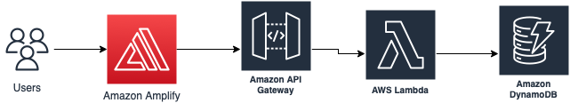

# Equipment Record Monitor

## Overview 📝

A monitor to show equipment records. One can add, delete and search for a record.

## Technologies👨🏻‍💻
### Frontend
* React
* Axios
* React-router
* Material-table

### Backend
* AWS Amplify
* AWS API Gateway
* AWS Lambda
* DynamoDB

## Usage🛠
The application is located in: https://main.d1z25lidbsa9em.amplifyapp.com/, one can interact with the frontend or directly with the API: https://2zqzf5jn07.execute-api.eu-west-1.amazonaws.com/prod

Interact with the API:
* fetch X equipment records: GET https://2zqzf5jn07.execute-api.eu-west-1.amazonaws.com/prod/equipment/search?limit=\<X\>

e.g.: 
```bash
curl -X GET https://2zqzf5jn07.execute-api.eu-west-1.amazonaws.com/prod/equipment/search\?limit\=2
```

This example will return 3 equipment records.

* Search for a specific equipment record: GET https://2zqzf5jn07.execute-api.eu-west-1.amazonaws.com/prod/equipment/\<equipment number\>

e.g.: 
```bash
curl -X GET https://2zqzf5jn07.execute-api.eu-west-1.amazonaws.com/prod/equipment/2
```

This example searches for an equipment record whose equipment number is 2.

* Create an equipment record: POST https://2zqzf5jn07.execute-api.eu-west-1.amazonaws.com/prod/equipment with equipment record as request payload.

e.g.:
```bash
curl -X POST https://2zqzf5jn07.execute-api.eu-west-1.amazonaws.com/prod/equipment -H "Content-Type:application/json" --data '{"equipNum":"2","address":"Espoo","contractStart":"2022-03-20","contractEnd":"2022-03-25","status":"Running"}'
```

This example will create a new equipment record and stores it in the database.

* Delete a records: DELETE https://2zqzf5jn07.execute-api.eu-west-1.amazonaws.com/prod/equipment/\<equipment number\>


e.g.: 
```bash
curl -X DELETE https://2zqzf5jn07.execute-api.eu-west-1.amazonaws.com/prod/equipment/2
```

This example deletes equipment records whose equipment number is 2.

## Solution💡

I adopted **React** to develop the frontend, because with **React**, one can conveniently reuse components, this is suitable for cooperation between developers. I used **material-table** to render the table because it offers various custom actions to configure different operations on row data. I used **react-router** to manage routes and **Axios** as HTTP client. The frontend is hosted in **AWS Amplify**, because it can build and host an extensible full-stack application. Also, it can connect to **Github** and trigger **CI/CD**. Therefore, whenever this git repository has a new commit, it'd trigger a new deployment.

When developing, I configured **Prettier** for maintaining code quality. **Git** for version control. Developers can easily manage environment variables with **.env** file.

I implemented a serverless backend in **AWS**, the figure below shows the architecture:



Equipment records are stored in **DynamoDB**, which is a reliable and serverless NoSQL database. Several **AWS Lambdas** were created to integrate with the database. **AWS Lambdas** is a lightweight serverless compute service, it runs my code in response and manages underlying compute resources for me. Requests are handled by **AWS API Gateway**. It can easily manage APIs and handles tasks, e.g., concurrent API calls, and traffic management.

source codes for frontend are located in **src** folder, source codes for **lambda** function are located in **AWS_lambda** folder.

## Future work📈
* All the AWS configurations can be specified in **AWS Cloudformation**, it is preferable to the AWS console, because it allows code review before editing infrastructure. We can also build **CI/CD** with **Cloudformation**, so that the pipeline is automated.
* Different **IAM** roles can be created and assigned to different developers so that we have permission control to decide who can deploy and edit cloud services.
* **AWS Cognito** can be added to the architecture to implement user authorization and authentication.
* **Grafana** can be configured to monitor the status of our system, e.g., the volume of request traffic.
* Utilize **Regex** for more fine-grained input validation.
* Integrate **GraphQL**. It has a strongly-typed schema to validate data, and it can save bandwidth without over-fetching data.